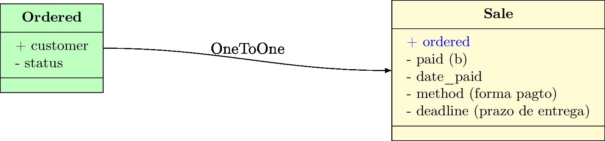
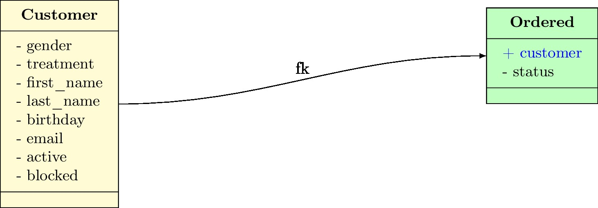

# ORM - Entendendo os relacionamentos do Django

## One to One (um para um)

Neste tipo de relacionamento também usamos **chave estrangeira**, só que um registro de uma tabela se relaciona apenas com um registro da outra tabela.

Uma **venda** pode ser feita a partir de apenas um **pedido**, então para reproduzir o esquema acima, usamos o seguinte código:

<pre>
    class Ordered(TimeStampedModel):
        customer = models.ForeignKey('Customer', verbose_name=_('cliente'), related_name='cliente_pedido')
        status = models.CharField(_('status'), max_length=2, choices=status_list, default='pe')

    class Sale(models.Model):
        ordered = models.<b>OneToOneField</b>('Ordered', verbose_name=_('pedido'))
        paid = models.BooleanField(_('pago'), default=False)
        date_paid = models.DateTimeField(_('pago em'), null=True, blank=True)
        method = models.CharField(_('forma de pagto'), max_length=20, blank=True)
        deadline = models.CharField(_('prazo de entrega'), max_length=50, blank=True)
</pre>

## One to Many (um para muitos)

É o relacionamento onde usamos **chave estrangeira**, conhecido como **ForeignKey**.

Um **cliente** pode fazer vários **pedidos**, então para reproduzir o esquema acima, usamos o seguinte código:

<pre>
    class Customer(models.Model):
        gender = models.CharField(_(u'gênero'), max_length=1, choices=gender_list)
        treatment = models.CharField(
            _('tratamento'), max_length=4, choices=treatment_list, blank=True)
        first_name = models.CharField(_('nome'), max_length=30)
        last_name = models.CharField(_('sobrenome'), max_length=30)
        birthday = models.DateTimeField(_('nascimento'), null=True, blank=True)
        email = models.EmailField(_('e-mail'), blank=True)
        active = models.BooleanField(_('ativo'), default=True)
        blocked = models.BooleanField(_('bloqueado'), default=False)

    class Ordered(TimeStampedModel):
        customer = models.<b>ForeignKey</b>(
            'Customer', verbose_name=_('cliente'), related_name='cliente_pedido')
        status = models.CharField(
            _('status'), max_length=2, choices=status_list, default='pe')
</pre>

## Many to Many
## Abstract Model
## Multi table inheritance
## Proxy models
